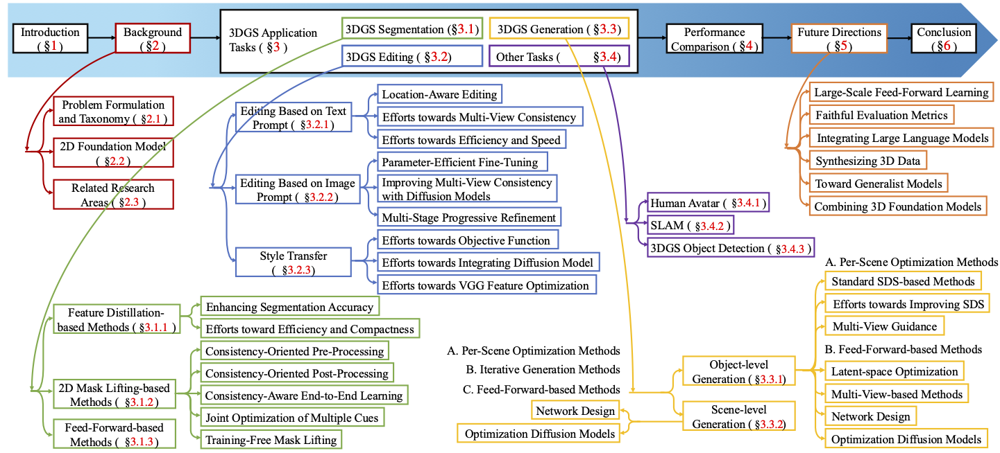

# 🔍 A Survey on 3D Gaussian Splatting Applications: Segmentation, Editing, and Generation
<p align="center">
    <a href="https://heshuting555.github.io/"><strong>Shuting He </strong></a>
   ·
    <a href=""><strong> Peilin Ji </strong></a>
    ·
    <a href=""><strong>Yitong Yang </strong></a>
    ·
    <a href="https://scholar.google.com/citations?user=dsV9sgwAAAAJ&hl=zh-CN"><strong>Changshuo Wang </strong></a>
    ·
    <a href="https://scholar.google.com/citations?user=xp_rICcAAAAJ&hl=zh-CN"><strong>Jiayi Ji</strong></a>
    ·
    <a href="http://simecv.sufe.edu.cn/page.aspx?id=80"><strong>Yinglin Wang</strong></a>
    ·
    <a href="https://henghuiding.github.io/"><strong>Henghui Ding</strong></a>
  </p>

💡 Welcome to the official repository of our journal paper.

📌 Please feel free to pull requests for any possibly missed wonderful work.

## ✨ Introduction
This survey presents the first detailed survey on 3DGS applications, including segmentation, editing, and generation.
<p align="center">
  
</p>


## 📚 Table of Contents

- [✂️ Existing Datasets for 3DGS Segmentation](#%EF%B8%8F-existing-datasets-for-3dgs-segmentation)
- [🗂️ Existing Datasets for 3DGS Editing](#%EF%B8%8F-existing-datasets-for-3dgs-editing)
- [🧩 Existing Datasets for 3DGS Generation](#-existing-datasets-for-3dgs-generation)
- [🛠️ Existing Methods for 3DGS Segmentation](#%EF%B8%8F-existing-methods-for-3dgs-segmentation)
- [✏️ Existing Methods for 3DGS Editing](#%EF%B8%8F-existing-methods-for-3dgs-editing)
- [🎨 Existing Methods for 3DGS Generation](#-existing-methods-for-3dgs-generation)
- [🎖 Other Application Tasks](#other-application-tasks)
  - [Human Avatar](#human-avatar)
  - [SLAM](#slam)
  - [3DGS Detection](#3dgs-detection)
- [⛳ Related Survey](#-related-survey)
- [📢 Citation](#-citation)

## ✂️ Existing Datasets for 3DGS Segmentation

This section summarizes commonly used datasets for segmentation tasks in 3D Gaussian Splatting.

| Datasets with URL   | Venue     | #Scenes | #Imgs  | Highlight |
|---------------------|-----------|---------|--------|-----------|
|[ScanNet](https://arxiv.org/abs/1702.04405)| CVPR'17 | 1513 | 1500  | Large-scale RGB-D scans with 3D poses and semantics for advanced scene understanding.|
|[Replica](https://arxiv.org/pdf/1906.05797) | ArXiv'19 | 18 | 175 | High-quality indoor scans with geometry, HDR textures, and rich semantic labels.|
|[NVOS](https://arxiv.org/abs/2103.05606) | CVPR'21 | 8 | 36 | Built on LLFF with undistorted images, annotated with masks and scribbles for segmentation tasks.| 
|[Mip-NeRF 360](https://arxiv.org/abs/2111.12077) | CVPR'22 | 9 | 215 | Focusing on capturing complex lighting, geometry, and texture details.|
|[SPIn-NeRF](https://arxiv.org/abs/2211.12254) | CVPR'23 | 10 | 100  | Providing challenging real-world scenes with views both with and without a target object.|
|[3D-OVS](https://arxiv.org/abs/2305.14093) | NeurIPS'23 | 10 | 30 | Including high-quality 3D objects spanning diverse categories with language-aligned semantic labels.|
| [LERF-OVS](https://arxiv.org/abs/2312.16084) | CVPR'24 | 4 | 200 | An extended version of LERF dataset with ground truth mask annotations for open-vocabulary segmentation.|
|[LERF-Mask](https://arxiv.org/abs/2312.00732) | ECCV'24 | 3 | 200 | Containing semantic annotations of three scenes from LERF dataset with a total of 23 prompts.|
|[Ref-LERF](https://openreview.net/forum?id=reuShgiHdg)| ICML'25 | 4 | 200 | Focusing on spatial relationships, annotated with natural language expressions for referring 3DGS segmentation.|


## 🗂️ Existing Datasets for 3DGS Editing

This section introduces datasets suitable for 3D editing tasks.

| Datasets with URL   | Venue     | #Scenes | #Imgs  | Highlight |
|---------------------|-----------|---------|--------|-----------|
| [DTU](https://www.cv-foundation.org/openaccess/content_cvpr_2014/html/Jensen_Large_Scale_Multi-view_2014_CVPR_paper.html) | CVPR'14 | 80 | 343 | Each scene consists of 49 or 64 accurate camera positions and reference structured light scans. |
| [Tanks and Temples](https://dl.acm.org/doi/abs/10.1145/3072959.3073599) | TOG'17 | 14 | - | Includes individual objects (e.g., Tank, Train) and large indoor scenes (e.g., Auditorium, Museum). |
| [GL3D](https://arxiv.org/abs/1811.10343) | ACCV'18 | 543 | 230 | Contains 125,623 high-res images captured by drones from various environments with geometric overlap. |
| [LLFF](https://arxiv.org/abs/1905.00889) | TOG'19 | 32 | 25 | Uses COLMAP SfM to compute poses for real images. |
| [BlendedMVS](https://arxiv.org/abs/1911.10127) | CVPR'20 | 113 | 158 | A large-scale MVS dataset, which contains a total of 17,818 images. |
| [NeRF-synthetic](https://arxiv.org/abs/2003.08934)| ECCV'20 | 8 | 100 | Objects on white backgrounds with 800×800 images and camera poses. |
| [Co3D](https://arxiv.org/abs/2109.00512) | CVPR'21 | - | - | Consists of 1.5 million frames extracted from ~19,000 videos, covering 50 MS-COCO categories with camera poses and 3D point clouds. |
| [Mip-NeRF360](https://arxiv.org/abs/2111.12077) | CVPR'22 | 9 | 215 | 360° panoramic images from indoor and outdoor environments. |
| [SPIn-NeRF](https://arxiv.org/abs/2211.12254) | CVPR'23 | 10 | 100 | Providing challenging real-world scenes with views both with and without a target object. |
| [IN2N](https://arxiv.org/abs/2303.12789) | ICCV'23 | 6 | 172 | Enabling structured and globally consistent 3D scene modifications while preserving the original scene's identity. |
| [ScanNet++](https://arxiv.org/abs/2308.11417) | ICCV'23 | 460 | 608 | 280,000 captured DSLR images, and over 3.7M iPhone RGBD frames. |
| [NeRFstudio](https://arxiv.org/abs/2302.04264) | SIGGRAPH'23 | 10 | - | Includes 4 phone captures with pinhole lenses and 6 mirrorless camera captures with fisheye lenses. |
| [360-USIDdataset](https://openreview.net/forum?id=AMVLOv30Qg) | ArXiv'25 | 7 | 300 | Includes 4 outdoor (Box, Cone, Lawn, Plant) and 3 indoor (Cookie, Sunflower, Dustpan) scenes. |


## 🧩 Existing Datasets for 3DGS Generation

This section covers datasets used for 3DGS-based generation tasks.

| Datasets with URL   | Venue     | #Scenes | #Imgs  | Highlight |
|---------------------|-----------|---------|--------|-----------|
| [NYUdepth](https://www.microsoft.com/en-us/research/wp-content/uploads/2016/11/shkf_eccv2012.pdf)| ECCV'12 | Image-to-3D | 464 | Contains 1449 RGBD images, capturing 464 diverse indoor scenes, with detailed annotations. |
| [ShapeNet](https://arxiv.org/abs/1512.03012) | ArXiv'15 | Image & Text-to-3D | 60K | These 3D models span 55 categories, each with a geometry file and unique identifier. |
| [ScanNet](https://arxiv.org/abs/1702.04405) | CVPR'17 | Image-to-3D | 1513 | Contains 2.5M views in 1513 indoor scenes annotated with 3D camera poses. |
| [RealEstate10K](https://arxiv.org/abs/1805.09817) | SIGGRAPH'18 | Image-to-3D | 80K | Comprises home walkthrough videos from YouTube. |
| [Replica](https://arxiv.org/pdf/1906.05797) | ArXiv'19 | Image-to-3D | 18 | A 3D indoor scene dataset featuring dense meshes, HDR textures, and semantic labels. |
| [ACID](https://arxiv.org/abs/2012.09855) | ICCV'21 | Image-to-3D | 13,047 | Features aerial landscape videos, includes 11,075 training scenes and 1,972 testing scenes. |
| [GSO](https://arxiv.org/abs/2204.11918) | ICRA'22 | Image & Text-to-3D | 1030 | Comprises 3D scanned common household items. |
| [LAION-5B](https://arxiv.org/abs/2210.08402) | NeurIPS'22 | Text-to-3D | - | LAION-5B's key feature is its vast scale, with 5.85 billion image-text pairs. |
| [Objaverse](https://arxiv.org/abs/2212.08051) | CVPR'23 | Image & Text-to-3D | 800K | Objaverse has a vast scale of 800K+ 3D models with rich annotations. |
| [OmniObject3D](https://arxiv.org/abs/2301.07525) | CVPR'23 | Image-to-3D | 6K | A large-scale collection of high-quality real-scanned 3D objects with rich 2D and 3D annotations. |
| [LOM](https://arxiv.org/abs/2312.09093) | AAAI'24 | Image-to-3D | 5 | Includes 5 real-world scenes, each with 25–48 sRGB images captured in difficult lighting. |
| [G-objaverse](https://link.springer.com/chapter/10.1007/978-3-031-72684-2_4) | ECCV'24 | Image & Text-to-3D | 280K | Contains 10 general classes totaling about 280K samples. |


## 🛠️ Existing Methods for 3DGS Segmentation

A summary of key segmentation approaches based on 3DGS.

| Year   | Venue     | Paper Abbr | Paper Title            |  Project/Code                                 |
|---------------------|-----------|--------------------|---------------------------|-------------|
| 2023 | NeurIPS  | SA3D | [ Segment Anything in 3D with Radiance Fields](http://arxiv.org/abs/2304.12308) |[Code](https://github.com/Jumpat/SegmentAnythingin3D) |
| 2024 | ArXiv | DCSEG | [ DCSEG: Decoupled 3D Open-Set Segmentation using Gaussian Splatting](http://arxiv.org/abs/2412.10972) | [Code](https://github.com/lusxvr/dcseg)  |
| 2024 | ArXiv | SuperGSeg | [ SuperGSeg: Open-Vocabulary 3D Segmentation with Structured Super-Gaussians](http://arxiv.org/abs/2412.10231) | ❌ |
| 2024 | ArXiv | GS3 | [ Point Cloud Unsupervised Pre-training via 3D Gaussian Splatting](https://arxiv.org/abs/2411.18667) | ❌ |
| 2024 | ArXiv  | SAGD | [ SAGD: Boundary-Enhanced Segment Anything in 3D Gaussian via Gaussian Decomposition](https://arxiv.org/abs/2401.17857) | [Code](https://github.com/XuHu0529/SAGS) |
| 2024 | ArXiv  | SLGaussian | [ SLGaussian: Fast Language Gaussian Splatting in Sparse Views](http://arxiv.org/abs/2412.08331) | ❌  |
| 2024 | ArXiv  | CLIP-GS | [ CLIP-GS: CLIP-Informed Gaussian Splatting for Real-time and View-consistent 3D Semantic Understanding](http://arxiv.org/abs/2404.14249) | [Code](https://gbliao.github.io/CLIP-GS.github.io/)  |
| 2024 | ArXiv  | GSemSplat| [ GSemSplat: Generalizable Semantic 3D Gaussian Splatting from Uncalibrated Image Pairs](http://arxiv.org/abs/2412.16932) | ❌ |
| 2024 | ArXiv  | Semantic Gaussians | [ Semantic Gaussians: Open-Vocabulary Scene Understanding with 3D Gaussian Splatting](http://arxiv.org/abs/2403.15624) | [Code](https://sharinka0715.github.io/semantic-gaussians/) |
| 2024 | ArXiv  | CoSegGaussians | [ Learning Segmented 3D Gaussians via Efficient Feature Unprojection for Zero-shot Neural Scene Segmentation](http://arxiv.org/abs/2405.18033) | [Code](https://David-Dou.github.io/CoSegGaussians) |
| 2024 | ArXiv  | LangSurf | [ LangSurf: Language-Embedded Surface Gaussians for 3D Scene Understanding](https://arxiv.org/abs/2412.17635) | [Code](https://langsurf.github.io) |
| 2024 | ArXiv  | GradiSeg | [ GradiSeg: Gradient-Guided Gaussian Segmentation with Enhanced 3D Boundary Precision](http://arxiv.org/abs/2412.00392) | ❌ |
| 2024 | ArXiv  | GLS | [ GLS: Geometry-aware 3D Language Gaussian Splatting](http://arxiv.org/abs/2411.18066) | [Code](https://jiaxiongq.github.io/GLS_ProjectPage/) |
| 2024 | ArXiv  | Gaga | [ Gaga: Group Any Gaussians via 3D-aware Memory Bank](https://arxiv.org/abs/2404.07977) | [Code](https://www.gaga.gallery/) |
| 2024 | ArXiv   | SA4D| [ Segment Any 4D Gaussians](https://arxiv.org/abs/2407.04504) | [Code](https://jsxzs.github.io/sa4d/) |
| 2024 | CVPR |   LangSplat   |        [LangSplat: 3D Language Gaussian Splatting](http://arxiv.org/abs/2312.16084)   |   [Code](https://langsplat.github.io/)    |
| 2024 | CVPR   | OmniSeg3D | [OmniSeg3D: Omniversal 3D Segmentation via Hierarchical Contrastive Learning](https://arxiv.org/abs/2311.11666) | [Code](https://github.com/OceanYing/OmniSeg3D-GS) |
| 2024 | CVPR |   Feature 3DGS   |     [Feature 3DGS: Supercharging 3D Gaussian Splatting to Enable Distilled Feature Fields](http://arxiv.org/abs/2312.03203)       | [Code](https://feature-3dgs.github.io/) |
| 2024 | CVPR |  LEGaussian |[Language Embedded 3D Gaussians for Open-Vocabulary Scene Understanding](http://arxiv.org/abs/2311.18482) | [Code](https://buaavrcg.github.io/LEGaussians) |
| 2024 | ACM MM | GOI  | [GOI: Find 3D Gaussians of Interest with an Optimizable Open-vocabulary Semantic-space Hyperplane](http://arxiv.org/abs/2405.17596)  | [Code](https://quyans.github.io/GOI-Hyperplane/) |
| 2024 | IJCV | FMGS |[ FMGS: Foundation Model Embedded 3D Gaussian Splatting for Holistic 3D Scene Understanding](http://arxiv.org/abs/2401.01970)  | [Code](https://xingxingzuo.github.io/fmgs/) |
| 2024 | ECCV | Gaussian Grouping | [ Gaussian Grouping: Segment and Edit Anything in 3D Scenes](https://arxiv.org/abs/2312.00732) | [Code](https://github.com/lkeab/gaussian-grouping) |
| 2024 | ECCV | EgoLifter | [ EgoLifter: Open-world 3D Segmentation for Egocentric Perception](http://arxiv.org/abs/2403.18118) | [Code](https://egolifter.github.io/) |
| 2024 | ECCV | Click-Gaussian | [ Click-Gaussian: Interactive Segmentation to Any 3D Gaussians](https://arxiv.org/abs/2407.11793) | [Code](https://seokhunchoi.github.io/Click-Gaussian/) |
| 2024 | ECCV | FiT3D | [ Improving 2D Feature Representations by 3D-Aware Fine-Tuning](http://arxiv.org/abs/2407.20229) | [Code](https://ywyue.github.io/FiT3D) |
| 2024 | ECCV | N2F2 | [ N2F2: Hierarchical Scene Understanding with Nested Neural Feature Fields](https://arxiv.org/abs/2403.10997) | ❌ |
| 2024 | ECCV  | FlashSplat| [ FlashSplat: 2D to 3D Gaussian Splatting Segmentation Solved Optimally](http://arxiv.org/abs/2409.08270) | [Code](https://github.com/florinshen/FlashSplat) |
| 2024 | NeurIPS  | GaussianCut | [ GaussianCut: Interactive segmentation via graph cut for 3D Gaussian Splatting](http://arxiv.org/abs/2411.07555) | ❌  |
| 2024 | NeurIPS | OpenGaussian | [ OpenGaussian: Towards Point-Level 3D Gaussian-based Open Vocabulary Understanding](http://arxiv.org/abs/2406.02058) | [Code](https://3d-aigc.github.io/OpenGaussian) |
| 2024 | ICPR | CGC | [ Contrastive Gaussian Clustering: Weakly Supervised 3D Scene Segmentation](https://arxiv.org/abs/2404.12784) | ❌ |
| 2024 | BMVC  | RT-GS2 | [ RT-GS2: Real-Time Generalizable Semantic Segmentation for 3D Gaussian Representations of Radiance Fields](http://arxiv.org/abs/2405.18033) | ❌ |
| 2025 | ArXiv   | THGS | [Training-Free Hierarchical Scene Understanding for Gaussian Splatting with Superpoint Graphs](https://arxiv.org/abs/2504.13153) | [Code](https://github.com/Atrovast/THGS) |
| 2025 | ArXiv   | SemanticSplat | [SemanticSplat: Feed-Forward 3D Scene Understanding with Language-Aware Gaussian Fields](https://arxiv.org/abs/2506.09565) | [Code](https://semanticsplat.github.io/) |
| 2025 | ArXiv  | FMLGS | [FMLGS: Fast Multilevel Language Embedded Gaussians for Part-level Interactive Agents](https://arxiv.org/abs/2504.08581) | ❌ |
| 2025 | ArXiv  | seconGS | [Semantic Consistent Language Gaussian Splatting for Point-Level Open-vocabulary Querying](https://arxiv.org/abs/2503.21767) | ❌ |
| 2025 | AAAI | SAGA | [ Segment Any 3D Gaussians](https://arxiv.org/abs/2312.00860) | [Code](https://jumpat.github.io/SAGA/) |
| 2025 | AAAI | FastLGS | [ FastLGS: Speeding up Language Embedded Gaussians with Feature Grid Mapping](http://arxiv.org/abs/2406.01916) | [Code](https://george-attano.github.io/FastLGS/)|
| 2025 | ICLR | VLGaussian | [ 3D Vision-Language Gaussian Splatting](http://arxiv.org/abs/2410.07577) | ❌ |
| 2025 | ICLR   | econSG | [econSG: Efficient and Multi-view Consistent Open-Vocabulary 3D Semantic Gaussians](https://arxiv.org/abs/2504.06003) | [Code](https://lulusindazc.github.io/econSGproject/) |
| 2025 | CVPR   | Unified-Lift| [Rethinking End-to-End 2D to 3D Scene Segmentation in Gaussian Splatting](https://arxiv.org/abs/2503.14029) | [Code](https://github.com/Runsong123/Unified-Lift) |
| 2025 | CVPR   | COB-GS| [COB-GS: Clear Object Boundaries in 3DGS Segmentation Based on Boundary-Adaptive Gaussian Splitting](https://arxiv.org/abs/2503.19443) | [Code](https://github.com/ZestfulJX/COB-GS) |
| 2025 | CVPR   | PanoGS | [PanoGS: Gaussian-based Panoptic Segmentation for 3D Open Vocabulary Scene Understanding](https://arxiv.org/abs/2503.18107) | [Code](https://github.com/zhaihongjia/PanoGS) |
| 2025 | CVPR   | Dr. Splat | [Dr. Splat: Directly Referring 3D Gaussian Splatting via Direct Language Embedding Registration](https://arxiv.org/abs/2502.16652) | [Code](https://drsplat.github.io/) |
| 2025 | CVPR   | CAGS | [CAGS: Open-Vocabulary 3D Scene Understanding with Context-Aware Gaussian Splatting](https://arxiv.org/abs/2504.11893) | ❌ |
| 2025 | CVPR   | DF_3DGS | [Efficient Decoupled Feature 3D Gaussian Splatting via Hierarchical Compression](https://cvpr.thecvf.com/virtual/2025/poster/34457) | [Code](https://github.com/dai647/DF_3DGS) |
| 2025 | CVPR | InstanceGaussian | [ InstanceGaussian: Appearance-Semantic Joint Gaussian Representation for 3D Instance-Level Perception](https://arxiv.org/abs/2411.19235) | [Code](https://lhj-git.github.io/InstanceGaussian/) |
| 2025 | CVPR   | iSegMan | [iSegMan: Interactive Segment-and-Manipulate 3D Gaussians](https://arxiv.org/abs/2505.11934) | [Code](https://zhao-yian.github.io/iSegMan/) |
| 2025 | ICCV  | ILGS | [Identity-aware Language Gaussian Splatting for Open-vocabulary 3D Semantic Segmentation](https://iccv.thecvf.com/virtual/2025/poster/2029) | [Code](https://github.com/DCVL-3D/ILGS_release) |
| 2025 | ICCV  | VoteSplat | [VoteSplat: Hough Voting Gaussian Splatting for 3D Scene Understanding](https://arxiv.org/abs/2506.22799) | [Code](https://sy-ja.github.io/votesplat/) |
| 2025 | ICCV  | SceneSplat |[SceneSplat: Gaussian Splatting-based Scene Understanding with Vision-Language Pretraining](https://arxiv.org/abs/2503.18052)| [Code](https://unique1i.github.io/SceneSplat_webpage/) |
| 2025 | ICCV  | ObjectGS | [ObjectGS: Object-aware Scene Reconstruction and Scene Understanding via Gaussian Splatting](https://arxiv.org/abs/2507.15454)| [Code](https://ruijiezhu94.github.io/ObjectGS_page/) |
| 2025 | ICCV  | CCL-LGS |[CCL-LGS: Contrastive Codebook Learning for 3D Language Gaussian Splatting](https://arxiv.org/abs/2505.20469)| [Code](https://epsilontl.github.io/CCL-LGS/) |
| 2025 | ICCV  | LUDVIG | [LUDVIG: Learning-free uplifting of 2d visual features to Gaussian splatting scenes](https://arxiv.org/abs/2410.14462) | [Code](https://juliettemarrie.github.io/ludvig/) |
| 2025 | ICCV   | LangScene-X | [LangScene-X: Reconstruct Generalizable 3D Language-Embedded Scenes with TriMap Video Diffusion](https://arxiv.org/abs/2507.02813) | [Code](https://liuff19.github.io/LangScene-X/) |
| 2025 | WACV  | GaussianBeV | [ GaussianBeV: 3D Gaussian Representation meets Perception Models for BeV Segmentation](http://arxiv.org/abs/2407.14108) | ❌ |
| 2025 | WACV   | LBG | [Lifting by Gaussians: A Simple, Fast and Flexible Method for 3D Instance Segmentation](https://arxiv.org/abs/2502.00173) | ❌ |

## ✏️ Existing Methods for 3DGS Editing

Overview of methods that enable direct or indirect editing of 3DGS content.

| Year | Venue | Paper Abbr | Title | Project/Code |
|------|-------|---------|-------|--------------|
| 2024 | ArXiv | GaussianVTON | [Gaussianvton: 3d human virtual try-on via multi-stage gaussian splatting editing with image prompting](https://arxiv.org/abs/2405.07472) | [Code](https://haroldchen19.github.io/gsvton/) |
| 2024 | ArXiv | Infusion | [InFusion: Inpainting 3D Gaussians via Learning Depth Completion from Diffusion Prior](http://arxiv.org/abs/2404.11613) | [Code](https://johanan528.github.io/Infusion/) |
| 2024 | ArXiv | StyleSplat | [Stylesplat: 3d object style transfer with gaussian splatting](https://arxiv.org/abs/2407.09473) | ❌ |
| 2024 | ArXiv | StylizedGS | [Stylizedgs: Controllable stylization for 3d gaussian splatting](https://arxiv.org/abs/2404.05220) | ❌ |
| 2024 | ArXiv | TIGER | [TIGER: Text-Instructed 3D Gaussian Retrieval and Coherent Editing](http://arxiv.org/abs/2405.14455) | [Code](https://xutanxing.github.io/TIGER/) |
| 2024 | ArXiv | 360-INPAINTR | [360-INPAINTR: REFERENCE-GUIDED 3D INPAINTING FOR UNBOUNDED SCENES](https://openreview.net/pdf/ee332494bcd7f9e4b66494d65eb850f61e9a0b43.pdf) | ❌ |
| 2024 | ArXiv        | 3DSceneEditor | [3dsceneeditor: Controllable 3d scene editing with gaussian splatting](https://arxiv.org/abs/2412.01583) | [Code](https://ziyangyan.github.io/3DSceneEditor/) |
| 2024 | ArXiv        | -          | [Diffusion-Based Attention Warping for Consistent 3D Scene Editing](https://arxiv.org/abs/2412.07984) | [Code](https://attention-warp.github.io/) |
| 2024 | ArXiv        | DynamicAvatars | [DynamicAvatars: Accurate Dynamic Facial Avatars Reconstruction and Precise Editing with Diffusion Models](https://arxiv.org/abs/2411.15732) | ❌ |
| 2024 | ArXiv        | -          | [Gaussian splatting in style](https://arxiv.org/abs/2403.08498) | ❌ |
| 2024 | ArXiv      | GSEdit       | [Gsedit: Efficient text-guided editing of 3d objects via gaussian splatting](https://arxiv.org/abs/2403.05154) | ❌ |
| 2024 | ArXiv        | GS-VTON     | [GS-VTON: Controllable 3D Virtual Try-on with Gaussian Splatting](https://arxiv.org/abs/2410.05259) | [Code](https://yukangcao.github.io/GS-VTON/) |
| 2024 | ArXiv        | ICE-G       | [Ice-g: Image conditional editing of 3d gaussian splats](https://arxiv.org/abs/2406.08488) | [Code](https://ice-gaussian.github.io/) |
| 2024 | ArXiv        | InstantStyleGaussian | [Instantstylegaussian: Efficient art style transfer with 3d gaussian splatting](https://arxiv.org/abs/2408.04249) | ❌ |
| 2024 | ArXiv        | MvDrag3D    | [MvDrag3D: Drag-based Creative 3D Editing via Multi-view Generation-Reconstruction Priors](https://arxiv.org/abs/2410.16272) | [Code](https://chenhonghua.github.io/MyProjects/MvDrag3D/) |
| 2024 | ArXiv        | NeuralSurfacePriors | [Neural Surface Priors for Editable Gaussian Splatting](https://arxiv.org/abs/2411.18311) | [Code](https://github.com/WJakubowska/NeuralSurfacePriors) |
| 2024 | ArXiv        | PERSE       | [PERSE: Personalized 3D Generative Avatars from A Single Portrait](https://arxiv.org/abs/2412.21206) | [Code](https://hyunsoocha.github.io/perse/) |
| 2024 | ArXiv        | ProGDF      | [ProGDF: Progressive Gaussian Differential Field for Controllable and Flexible 3D Editing](https://arxiv.org/abs/2412.08152) | ❌ |
| 2024 | ArXiv        | RefFusion   | [Reffusion: Reference adapted diffusion models for 3d scene inpainting](https://arxiv.org/abs/2404.10765) | [Code](https://reffusion.github.io/) |
| 2024 | ArXiv        | SGSST       | [SGSST: Scaling Gaussian Splatting StyleTransfer](https://arxiv.org/abs/2412.03371) | ❌ |
| 2024 | ArXiv        | Trame       | [Trame: Trajectory-anchored multi-view editing for text-guided 3d gaussian splatting manipulation](https://arxiv.org/abs/2407.02034) | ❌ |
| 2024 | CVPR | GaussianEditor | [Gaussianeditor: Swift and controllable 3d editing with gaussian splatting](http://openaccess.thecvf.com/content/CVPR2024/html/Chen_GaussianEditor_Swift_and_Controllable_3D_Editing_with_Gaussian_Splatting_CVPR_2024_paper.html) | [Code](https://buaacyw.github.io/gaussian-editor/) |
| 2024 | CVPR | GaussianEditorText | [Gaussianeditor: Editing 3d gaussians delicately with text instructions](https://openaccess.thecvf.com/content/CVPR2024/html/Wang_GaussianEditor_Editing_3D_Gaussians_Delicately_with_Text_Instructions_CVPR_2024_paper.html) | [Code](https://gaussianeditor.github.io/) |
| 2024 | CVPR | FruitNinja | [FruitNinja: 3D Object Interior Texture Generation with Gaussian Splatting](http://arxiv.org/abs/2411.12089) | [Code](https://fanguw.github.io/FruitNinja3D/) |
| 2024 | ECCV | GaussianGrouping | [Gaussian grouping: Segment and edit anything in 3d scenes](https://link.springer.com/chapter/10.1007/978-3-031-73397-0_10) | [Code](https://langsplat.github.io/) |
| 2024 | ECCV | Texture-GS | [Texture-GS: Disentangling the Geometry and Texture for 3D Gaussian Splatting Editing](http://arxiv.org/abs/2403.10050) | ❌ |
| 2024 | ECCV | GScream | [GScream: Learning 3D Geometry and Feature Consistent Gaussian Splatting for Object Removal](https://dl.acm.org/doi/10.1145/3681758.3698002) | ❌ |
| 2024 | ECCV | GaussCtrl | [GaussCtrl: Multi-View Consistent Text-Driven 3D Gaussian Splatting Editing](http://arxiv.org/abs/2403.08733) | [Code](https://gaussctrl.active.vision/) |
| 2024 | ECCV       | 3DEgo        | [3DEgo: 3D Editing on the Go!](https://arxiv.org/pdf/2407.10102) | [Code](https://3dego.github.io/) |
| 2024 | ECCV | DGE | [Dge: Direct gaussian 3d editing by consistent multi-view editing](https://link.springer.com/chapter/10.1007/978-3-031-72904-1_5) | [Code](https://silent-chen.github.io/DGE/) |
| 2024 | ECCV       | GScream     | [Learning 3D Geometry and Feature Consistent Gaussian Splatting for Object Removal](https://link.springer.com/chapter/10.1007/978-3-031-72646-0_1) | [Code](https://w-ted.github.io/publications/gscream/) |
| 2024 | ECCV       | -         | [View-consistent 3d editing with gaussian splatting](https://link.springer.com/chapter/10.1007/978-3-031-72761-0_23) | [Code](https://vcedit.github.io/) |
| 2024 | ECCV       | WaSt-3D     | [Wast-3d: Wasserstein-2 distance for scene-to-scene stylization on 3d gaussians](https://link.springer.com/chapter/10.1007/978-3-031-72664-4_17) | [Code](https://compvis.github.io/wast3d/) |
| 2024 | NeurIPS    | ReGS        | [ReGS: Reference-based Controllable Scene Stylization with Gaussian Splatting](https://proceedings.neurips.cc/paper_files/paper/2024/hash/076c1fa639a7190e216e734f0a1b3e7b-Abstract-Conference.html) | ❌ |
| 2024 | NeurIPS    | ProEdit     | [ProEdit: Simple Progression is All You Need for High-Quality 3D Scene Editing](https://arxiv.org/abs/2411.05006) | [Code](https://immortalco.github.io/ProEdit/) |
| 2024 | NeurIPS    | D-MiSo       | [D-miso: Editing dynamic 3d scenes using multi-gaussians soup](https://proceedings.neurips.cc/paper_files/paper/2024/hash/c32319f4868da7613d78af9993100e42-Abstract-Conference.html) | [Code](https://github.com/waczjoan/D-MiSo) |
| 2024 | Computer Graphics Forum | GSEditPro | [GSEditPro: 3D Gaussian Splatting Editing with Attention‐based Progressive Localization](https://onlinelibrary.wiley.com/doi/abs/10.1111/cgf.15215) | ❌ |
| 2024 | Computer Graphics Forum | G-Style   | [*𝒢*‐Style: Stylized Gaussian Splatting](https://onlinelibrary.wiley.com/doi/abs/10.1111/cgf.15259) | ❌ |
| 2024 | ACM TOG | TIP-Editor | [Tip-editor: An accurate 3d editor following both text-prompts and image-prompts](https://dl.acm.org/doi/abs/10.1145/3658205) | [Code](https://zjy526223908.github.io/TIP-Editor/) |
| 2024 | SA | StyleGaussian | [StyleGaussian: Instant 3D Style Transfer with Gaussian Splatting](http://arxiv.org/abs/2404.13679) | [Code](https://kunhao-liu.github.io/StyleGaussian/) |
| 2024 | GCH | SemanticSplatStylization | [SemanticSplatStylization: Semantic scene stylization based on 3D Gaussian splatting and class-based style transfer](http://arxiv.org/abs/2404.11613) | ❌ |
| 2024 | ACM MM     | -         | [3D Gaussian Editing with A Single Image](https://dl.acm.org/doi/pdf/10.1145/3664647.3680858) | ❌ |
| 2024 | ACM MM     | GGAvatar     | [GGAvatar: Reconstructing Garment-Separated 3D Gaussian Splatting Avatars from Monocular Video](https://dl.acm.org/doi/abs/10.1145/3696409.3700241) | [Code](https://github.com/J-X-Chen/GGAvatar/) |
| 2024 | IET Image Processing | PointnMove | [Point'n Move: Interactive scene object manipulation on Gaussian splatting radiance fields](https://ietresearch.onlinelibrary.wiley.com/doi/full/10.1049/ipr2.13190) | ❌ |
| 2024 | TMLR        | -          | [Enhancing Temporal Consistency in Video Editing by Reconstructing Videos with 3D Gaussian Splatting](https://arxiv.org/abs/2406.02541) | [Code](https://video-3dgs-project.github.io/) |
| 2024 | SIGGRAPH   | PortraitGen | [Portrait video editing empowered by multimodal generative priors](https://dl.acm.org/doi/abs/10.1145/3680528.3687601) | [Code](https://ustc3dv.github.io/PortraitGen/) |
| 2025 | ArXiv       | -         | [Drag Your Gaussian: Effective Drag-Based Editing with Score Distillation for 3D Gaussian Splatting](https://arxiv.org/abs/2501.18672) | [Code](https://quyans.github.io/Drag-Your-Gaussian/) |
| 2025 | ArXiv  | Dragen3D     | [Dragen3D: Multiview Geometry Consistent 3D Gaussian Generation with Drag-Based Control](https://arxiv.org/abs/2502.16475) | ❌ |
| 2025 | ArXiv         | MultiDreamer3D | [MultiDreamer3D: Multi-concept 3D Customization with Concept-Aware Diffusion Guidance](https://arxiv.org/abs/2501.13449) | ❌ |
| 2025 | ICLR | DreamCatalyst | [DreamCatalyst: Fast and High-Quality 3D Editing via Controlling Editability and Identity Preservation](https://arxiv.org/abs/2407.11394) | [Code](https://dream-catalyst.github.io/) |
| 2025 | ICLR        | 3DitScene    | [3DitScene: Editing Any Scene via Language-guided Disentangled Gaussian Splatting](https://arxiv.org/abs/2405.18424) | [Code](https://zqh0253.github.io/3DitScene/) |
| 2025 | CVPR    | OmniSplat       | [OmniSplat: Taming Feed-Forward 3D Gaussian Splatting for Omnidirectional Images with Editable Capabilities](https://arxiv.org/abs/2412.16604) | [Code](https://robot0321.github.io/omnisplat/index.html) |
| 2025 | CVPR    | DaCapo       | [DaCapo: Score Distillation as Stacked Bridge for Fast and High-quality 3D Editing](https://openaccess.thecvf.com/content/CVPR2025/html/Huang_DaCapo_Score_Distillation_as_Stacked_Bridge_for_Fast_and_High-quality_CVPR_2025_paper.html) | ❌ |
| 2025 | CVPR    | CTRL-D       | [CTRL-D: Controllable Dynamic 3D Scene Editing with Personalized 2D Diffusion](https://arxiv.org/abs/2412.01792) | [Code](https://ihe-kaii.github.io/CTRL-D/) |
| 2025 | CVPR    | InterGSEdit       | [InterGSEdit: Interactive 3D Gaussian Splatting Editing with 3D Geometry-Consistent Attention Prior](https://arxiv.org/abs/2507.04961) | ❌ |
| 2025 | CVPR | EditSplat | [EditSplat: Multi-View Fusion and Attention-Guided Optimization for View-Consistent 3D Scene Editing with 3D Gaussian Splatting](http://arxiv.org/abs/2412.11520) | [Code](https://kuai-lab.github.io/editsplat2024/) |
| 2025 | WACV        | -         | [Localized Gaussian Splatting Editing with Contextual Awareness](https://arxiv.org/abs/2408.00083) | ❌ |
| 2025 | ICMR        | ArtNVG       | [ArtNVG: Content-Style Separated Artistic Neighboring-View Gaussian Stylization](https://arxiv.org/abs/2412.18783) | ❌ |
| 2025 | ACM MM    | PSP       | [Prompt-Softbox-Prompt: A free-text Embedding Control for Image Editing](https://arxiv.org/abs/2408.13623) | ❌ |

## 🎨 Existing Methods for 3DGS Generation

Discusses generation methods that produce 3DGS representations from multimodal inputs like text and image.

| Year | Venue | Paper Abbr | Title | Project/Code |
|------|-------|---------|-------|---------|
| 2023 | ArXiv    | Luciddreamer     | [Luciddreamer: Domain-free generation of 3d gaussian splatting scenes](https://arxiv.org/abs/2311.13384) | [Code](https://github.com/luciddreamer-cvlab/LucidDreamer) |
| 2023 | ArXiv   | StableDreamer | [Stabledreamer: taming noisy score distillation sampling for text-to-3d](https://arxiv.org/abs/2312.02189) | ❌ |
| 2023 | ArXiv   | CG3D | [Cg3d: Compositional generation for text-to-3d via gaussian splatting](https://arxiv.org/abs/2311.17907) | [Code](https://asvilesov.github.io/CG3D/) |
| 2023 | ArXiv   | Text2Immersion | [Text2immersion: Generative immersive scene with 3d gaussians](https://arxiv.org/abs/2312.09242) | [Code](https://ken-ouyang.github.io/text2immersion/index.html) |
| 2023 | ICCV  | Text2Room | [Text2room: Extracting textured 3d meshes from 2d text-to-image models](http://openaccess.thecvf.com/content/ICCV2023/html/Hollein_Text2Room_Extracting_Textured_3D_Meshes_from_2D_Text-to-Image_Models_ICCV_2023_paper.html) | [Code](https://lukashoel.github.io/text-to-room/) |
| 2024 | ArXiv   | GaussianDreamerPro | [Gaussiandreamerpro: Text to manipulable 3d gaussians with highly enhanced quality](https://arxiv.org/abs/2406.18462) | [Code](https://arxiv.org/abs/2406.18462) |
| 2024 | ArXiv   | CompGS | [CompGS: Unleashing 2D Compositionality for Compositional Text-to-3D via Dynamically Optimizing 3D Gaussians](https://arxiv.org/abs/2410.20723) | [Code](https://chongjiange.github.io/compgs.html) |
| 2024 | ArXiv   | GraphCanvas | [Graph Canvas for Controllable 3D Scene Generation](https://arxiv.org/abs/2412.00091) | [Code](https://github.com/ILGLJ/Graph-Canvas) |
| 2024 | ArXiv   | LayerPano3D | [Layerpano3d: Layered 3d panorama for hyper-immersive scene generation](https://arxiv.org/abs/2408.13252) | [Code](https://layerpano3d-web.github.io/) |
| 2024 | ArXiv   | SceneDreamer360 | [Scenedreamer360: Text-driven 3d-consistent scene generation with panoramic gaussian splatting](https://arxiv.org/abs/2408.13711) | [Code](https://github.com/liwrui/SceneDreamer360) |
| 2024 | ArXiv   | DreamerXL | [Dreamer XL: Towards High-Resolution Text-to-3D Generation via Trajectory Score Matching](https://arxiv.org/abs/2405.11252) | [Code](https://github.com/xingy038/Dreamer-XL) |
| 2024 | ArXiv   | MVGaussian | [MVGaussian: High-Fidelity text-to-3D Content Generation with Multi-View Guidance and Surface Densification](https://arxiv.org/abs/2409.06620) | [Code](https://mvgaussian.github.io/) |
| 2024 | ArXiv   | GradeADreamer | [GradeADreamer: Enhanced Text-to-3D Generation Using Gaussian Splatting and Multi-View Diffusion](https://arxiv.org/abs/2406.09850) | [Code](https://github.com/trapoom555/GradeADreamer) |
| 2024 | ArXiv    | PanoDreamer      | [PanoDreamer: 3D Panorama Synthesis from a Single Image](https://arxiv.org/abs/2412.04827) | [Code](https://people.engr.tamu.edu/nimak/Papers/PanoDreamer/index.html) |
| 2024 | ArXiv    | ScalingGaussian  | [ScalingGaussian: Enhancing 3D Content Creation with Generative Gaussian Splatting](https://arxiv.org/abs/2407.19035) | ❌ |
| 2024 | ArXiv    | Physics3D        | [Physics3d: Learning physical properties of 3d gaussians via video diffusion](https://arxiv.org/abs/2406.04338) | [Code](https://liuff19.github.io/Physics3D/) |
| 2024 | ArXiv    | -             | [Enhancing Single Image to 3D Generation using Gaussian Splatting and Hybrid Diffusion Priors](https://arxiv.org/abs/2410.09467) | ❌ |
| 2024 | ArXiv   | GECO             | [GECO: Generative Image-to-3D within a SECOnd](https://arxiv.org/abs/2405.20327) | N/A |
| 2024 | ArXiv    | DreamPhysics     | [Dreamphysics: Learning physical properties of dynamic 3d gaussians with video diffusion priors](https://arxiv.org/abs/2406.01476) | [Code](https://github.com/tyhuang0428/DreamPhysics) |
| 2024 | ArXiv    | GaussianPainter  | [GaussianPainter: Painting Point Cloud into 3D Gaussians with Normal Guidance](https://arxiv.org/abs/2412.17715) | [Code](https://github.com/zhou745/GaussianPainter) |
| 2024 | ArXiv    | Gaussianstego    | [Gaussianstego: A generalizable stenography pipeline for generative 3d gaussians splatting](https://arxiv.org/abs/2407.01301) | [Code](https://gaussian-stego.github.io/) |
| 2024 | ArXiv    | GeoGS3D          | [GeoGS3D: Single-view 3D Reconstruction via Geometric-aware Diffusion Model and Gaussian Splatting](https://arxiv.org/abs/2403.10242) | [Code](https://qjfeng.net/GeoGS3D/) |
| 2024 | ArXiv    | NovelGS          | [NovelGS: Consistent Novel-view Denoising via Large Gaussian Reconstruction Model](https://arxiv.org/abs/2411.16779) | ❌ |
| 2024 | ArXiv    | HoloDreamer         | [Holodreamer: Holistic 3d panoramic world generation from text descriptions](https://arxiv.org/abs/2407.15187) | ❌ |
| 2024 | ArXiv    | BrightDreamer       | [Brightdreamer: Generic 3d gaussian generative framework for fast text-to-3d synthesis](https://arxiv.org/abs/2403.11273) | [Code](https://vlislab22.github.io/BrightDreamer/) |
| 2024 | ArXiv    | Flex3D              | [Flex3d: Feed-forward 3d generation with flexible reconstruction model and input view curation](https://arxiv.org/abs/2410.00890) | [Code](https://junlinhan.github.io/projects/flex3d/) |
| 2024 | ArXiv    | -              | [Text-to-3D Gaussian Splatting with Physics-Grounded Motion Generation](https://arxiv.org/abs/2412.05560) | ❌ |
| 2024 | ArXiv   | DreamScape       | [DreamScape: 3D Scene Creation via Gaussian Splatting joint Correlation Modeling](https://arxiv.org/abs/2404.09227) | ❌ |
| 2024 | ArXiv   | DreamPolisher    | [Dreampolisher: Towards high-quality text-to-3d generation via geometric diffusion](https://arxiv.org/abs/2403.17237) | [Code](https://yuanze-lin.me/DreamPolisher_page/) |
| 2024 | ArXiv    | Prometheus          | [Prometheus: 3D-Aware Latent Diffusion Models for Feed-Forward Text-to-3D Scene Generation](https://arxiv.org/abs/2412.21117) | [Code](https://github.com/XDimLab/Prometheus) |
| 2024 | ArXiv   | DreamMapping | [DreamMapping: High-Fidelity Text-to-3D Generation via Variational Distribution Mapping](https://arxiv.org/abs/2409.05099) | ❌ |
| 2024 | ICLR   | DreamGaussian | [Dreamgaussian: Generative gaussian splatting for efficient 3d content creation](https://arxiv.org/abs/2309.16653) | [Code](https://dreamgaussian.github.io/) |
| 2024 | CVPR  | GSGen | [Text-to-3d using gaussian splatting](http://openaccess.thecvf.com/content/CVPR2024/html/Chen_Text-to-3D_using_Gaussian_Splatting_CVPR_2024_paper.html) | [Code](https://github.com/gsgen3d/gsgen) |
| 2024 | CVPR  | GaussianDreamer | [Gaussiandreamer: Fast generation from text to 3d gaussians by bridging 2d and 3d diffusion models](http://openaccess.thecvf.com/content/CVPR2024/html/Yi_GaussianDreamer_Fast_Generation_from_Text_to_3D_Gaussians_by_Bridging_CVPR_2024_paper.html) | [Code](https://arxiv.org/abs/2406.18462) |
| 2024 | CVPR  | HumanGaussian | [Humangaussian: Text-driven 3d human generation with gaussian splatting](http://openaccess.thecvf.com/content/CVPR2024/html/Liu_HumanGaussian_Text-Driven_3D_Human_Generation_with_Gaussian_Splatting_CVPR_2024_paper.html) | [Code](https://alvinliu0.github.io/projects/HumanGaussian) |
| 2024 | CVPR  | LucidDreamer | [Luciddreamer: Towards high-fidelity text-to-3d generation via interval score matching](http://openaccess.thecvf.com/content/CVPR2024/html/Liang_LucidDreamer_Towards_High-Fidelity_Text-to-3D_Generation_via_Interval_Score_Matching_CVPR_2024_paper.html) | [Code](https://github.com/EnVision-Research/LucidDreamer) |
| 2024 | CVPR   | WonderJourney       | [Wonderjourney: Going from anywhere to everywhere](http://openaccess.thecvf.com/content/CVPR2024/html/Yu_WonderJourney_Going_from_Anywhere_to_Everywhere_CVPR_2024_paper.html) | [Code](https://kovenyu.com/wonderjourney/) |
| 2024 | CVPR   | Hash3D           | [Hash3d: Training-free acceleration for 3d generation](https://arxiv.org/abs/2404.06091) | [Code](https://adamdad.github.io/hash3D/) |
| 2024 | CVPR   | TriplaneGaussian | [Triplane meets gaussian splatting: Fast and generalizable single-view 3d reconstruction with transformers](http://openaccess.thecvf.com/content/CVPR2024/html/Zou_Triplane_Meets_Gaussian_Splatting_Fast_and_Generalizable_Single-View_3D_Reconstruction_CVPR_2024_paper.html) | [Code](https://zouzx.github.io/TriplaneGaussian/) |
| 2024 | CVPR    | Ouroboros3D      | [Ouroboros3d: Image-to-3d generation via 3d-aware recursive diffusion](https://arxiv.org/abs/2406.03184) | [Code](https://costwen.github.io/Ouroboros3D/) |
| 2024 | CVPR Workshop  | Art3D               | [Art3d: 3d gaussian splatting for text-guided artistic scenes generation](https://arxiv.org/abs/2405.10508) | ❌ |
| 2024 | ECCV  | GCS-BEG | [Connecting consistency distillation to score distillation for text-to-3d generation](https://link.springer.com/chapter/10.1007/978-3-031-72775-7_16) | [Code](https://github.com/LMozart/ECCV2024-GCS-BEG) |
| 2024 | ECCV  | DreamScene | [Dreamscene: 3d gaussian-based text-to-3d scene generation via formation pattern sampling](https://link.springer.com/chapter/10.1007/978-3-031-72904-1_13) | [Code](https://dreamscene-project.github.io/) |
| 2024 | ECCV   | DreamScene360       | [Dreamscene360: Unconstrained text-to-3d scene generation with panoramic gaussian splatting](https://link.springer.com/chapter/10.1007/978-3-031-72658-3_19) | [Code](https://dreamscene360.github.io/) |
| 2024 | ECCV   | VFusion3D           | [Vfusion3d: Learning scalable 3d generative models from video diffusion models](https://link.springer.com/chapter/10.1007/978-3-031-72627-9_19) | [Code](https://junlinhan.github.io/projects/vfusion3d.html) |
| 2024 | ECCV   | LGM              | [Lgm: Large multi-view gaussian model for high-resolution 3d content creation](https://link.springer.com/chapter/10.1007/978-3-031-73235-5_1) | [Code](https://me.kiui.moe/lgm/) |
| 2024 | ECCV   | GVGEN            | [Gvgen: Text-to-3d generation with volumetric representation](https://link.springer.com/chapter/10.1007/978-3-031-73242-3_26) | [Code](https://sotamak1r.github.io/gvgen/) |
| 2024 | ECCV   | FSGS             | [Fsgs: Real-time few-shot view synthesis using gaussian splatting](https://link.springer.com/chapter/10.1007/978-3-031-72933-1_9) | [Code](https://zehaozhu.github.io/FSGS/) |
| 2024 | ECCV    | GS-LRM           | [Gs-lrm: Large reconstruction model for 3d gaussian splatting](https://link.springer.com/chapter/10.1007/978-3-031-72670-5_1) | [Code](https://sai-bi.github.io/project/gs-lrm/) |
| 2024 | ECCV    | GRM              | [Grm: Large gaussian reconstruction model for efficient 3d reconstruction and generation](https://link.springer.com/content/pdf/10.1007/978-3-031-72633-0_1.pdf) | [Code](https://github.com/justimyhxu/grm) |
| 2024 | NeurIPS | Era3D            | [Era3d: high-resolution multiview diffusion using efficient row-wise attention](https://proceedings.neurips.cc/paper_files/paper/2024/hash/65a723bf7d8dad838c09178270d30e80-Abstract-Conference.html) | [Code](https://penghtyx.github.io/Era3D/) |
| 2024 | NeurIPS| Wild-GS          | [Wild-gs: Real-time novel view synthesis from unconstrained photo collections](https://proceedings.neurips.cc/paper_files/paper/2024/hash/bb11f79ad86f5e33e2a7c850cbdfed42-Abstract-Conference.html) | [Code](https://github.com/XuJiacong/Wild-GS) |
| 2024 | NeurIPS| ProlificDreamer  | [Prolificdreamer: High-fidelity and diverse text-to-3d generation with variational score distillation](https://proceedings.neurips.cc/paper_files/paper/2023/hash/1a87980b9853e84dfb295855b425c262-Abstract-Conference.html) | [Code](https://ml.cs.tsinghua.edu.cn/prolificdreamer/) |
| 2024 | NeurIPS | DiffGS           | [Diffgs: Functional gaussian splatting diffusion](https://proceedings.neurips.cc/paper_files/paper/2024/hash/41fb2ecb5b7d1b505bca787de0a603dc-Abstract-Conference.html) | [Code](https://junshengzhou.github.io/DiffGS/) |
| 2024 | NeurIPS | HumanSplat       | [Humansplat: Generalizable single-image human gaussian splatting with structure priors](https://proceedings.neurips.cc/paper_files/paper/2024/hash/87affd2029375d1be123ccdab5334c55-Abstract-Conference.html) | [Code](https://humansplat.github.io/) |
| 2024 | NeurIPS    | MVSplat360       | [MVSplat360: Feed-Forward 360 Scene Synthesis from Sparse Views](https://arxiv.org/abs/2411.04924) | [Code](https://donydchen.github.io/mvsplat360/) |
| 2024 | NeurIPS| GSGAN            | [GSGAN: Adversarial Learning for Hierarchical Generation of 3D Gaussian Splats](https://proceedings.neurips.cc/paper_files/paper/2024/hash/7d90c28e7820709792d969211815a2b3-Abstract-Conference.html) | [Code](https://hse1032.github.io/gsgan) |
| 2024 | ACM MM | Sketch3D         | [Sketch3D: Style-Consistent Guidance for Sketch-to-3D Generation](https://dl.acm.org/doi/abs/10.1145/3664647.3680641) | ❌ |
| 2024 | ACM MM  | Hi3D             | [Hi3D: Pursuing High-Resolution Image-to-3D Generation with Video Diffusion Models](https://dl.acm.org/doi/abs/10.1145/3664647.3681634) | [Code](https://github.com/yanghb22-fdu/Hi3D-Official) |
| 2024 | ACM MM  | -              | [Large point-to-gaussian model for image-to-3d generation](https://dl.acm.org/doi/abs/10.1145/3664647.3680920) | ❌ |
| 2024 | ACM MM  | DreamInit        | [A general framework to boost 3d gs initialization for text-to-3d generation by lexical richness](https://dl.acm.org/doi/abs/10.1145/3664647.3680740) | [Code](https://vlislab22.github.io/DreamInit/) |
| 2024 | TMLR    | AGG              | [Agg: Amortized generative 3d gaussians for single image to 3d](https://arxiv.org/abs/2401.04099) | [Code](https://ir1d.github.io/AGG/) |
| 2024 | ICML  | GALA3D | [Gala3d: Towards text-to-3d complex scene generation via layout-guided generative gaussian splatting](https://arxiv.org/abs/2402.07207) | [Code](https://gala3d.github.io/) |
| 2024 | 3DV   | MVControl | [Controllable text-to-3D generation via surface-aligned Gaussian splatting](https://arxiv.org/abs/2403.09981) | [Code](https://lizhiqi49.github.io/MVControl/) |
| 2024 | 3DV    | Realmdreamer        | [Realmdreamer: Text-driven 3d scene generation with inpainting and depth diffusion](https://arxiv.org/abs/2404.07199) | [Code](https://realmdreamer.github.io/) |
| 2024 | IJCAI    | FastScene           | [Fastscene: Text-driven fast 3d indoor scene generation via panoramic gaussian splatting](https://arxiv.org/abs/2405.05768) | ❌ |
| 2024 | WACV   | GANFusion           | [GANFusion: Feed-Forward Text-to-3D with Diffusion in GAN Space](https://arxiv.org/abs/2412.16717) | [Code](https://ganfusion.github.io/) |
| 2024 | IJCV   | Hyper3DG         | [Hyper-3dg: Text-to-3d gaussian generation via hypergraph](https://link.springer.com/article/10.1007/s11263-024-02298-y) | [Code](https://github.com/yjhboy/Hyper3DG) |
| 2025 | ArXiv   | GaussianMotion | [GaussianMotion: End-to-End Learning of Animatable Gaussian Avatars with Pose Guidance from Text](https://arxiv.org/abs/2502.11642) | ❌ |
| 2025 | ArXiv   | GSV3D            | [GSV3D: Gaussian Splatting-based Geometric Distillation with Stable Video Diffusion for Single-Image 3D Object Generation](https://arxiv.org/abs/2503.06136) | ❌ |
| 2025 | ArXiv    | LAYOUTDREAMER    | [LAYOUTDREAMER: Physics-guided Layout for Text-to-3D Compositional Scene Generation](https://arxiv.org/abs/2502.01949) | ❌ |
| 2025 | ArXiv | TextSplat       | [TextSplat: Text-Guided Semantic Fusion for Generalizable Gaussian Splatting](https://arxiv.org/abs/2504.09588) | ❌ |
| 2025 | ArXiv   | ViewCrafter       | [ViewCrafter: Taming Video Diffusion Models for High-fidelity Novel View Synthesis](https://arxiv.org/abs/2409.02048) | [Code](https://drexubery.github.io/ViewCrafter/) |
| 2025 | ArXiv  | WAVE   | [WAVE: Warp-Based View Guidance for Consistent Novel View Synthesis Using a Single Image](https://arxiv.org/abs/2506.23518) | [Code](https://jwoo-park0.github.io/wave.github.io/) |
| 2025 | ArXiv   | Triflow             | [Taming Feed-forward Reconstruction Models as Latent Encoders for 3D Generative Models](https://arxiv.org/abs/2501.00651) | [Code](https://triflow.github.io/) |
| 2025 | AAAI    | Multi-StyleGS       | [Multi-StyleGS: Stylizing Gaussian Splatting with Multiple Styles](https://arxiv.org/abs/2506.06846) | [Code](https://github.com/SCUTykLin/Multi-StyleGS) |
| 2025 | AAAI    | Cycle3D          | [Cycle3d: High-quality and consistent image-to-3d generation via generation-reconstruction cycle](https://arxiv.org/abs/2407.19548) | [Code](https://pku-yuangroup.github.io/Cycle3D/) |
| 2025 | ICLR   | LayoutYour3D | [Layout-your-3D: Controllable and Precise 3D Generation with 2D Blueprint](https://arxiv.org/abs/2410.15391) | [Code](https://colezwhy.github.io/layoutyour3d/) |
| 2025 | ICLR    | Atlas Gaussians   | [Atlas Gaussians Diffusion for 3D Generation](https://arxiv.org/abs/2408.13055) | [Code](https://yanghtr.github.io/projects/atlas_gaussians/) |
| 2025 | ICLR   | GaussianAnything    | [GaussianAnything: Interactive Point Cloud Latent Diffusion for 3D Generation](https://arxiv.org/abs/2411.08033) | [Code](https://nirvanalan.github.io/projects/ga/) |
| 2025 | ICLR  | CogVideoX | [CogVideoX: Text-to-Video Diffusion Models with An Expert Transformer](https://arxiv.org/abs/2408.06072) | [Code](https://github.com/zai-org/CogVideo) |
| 2025 | CVPR    | GaussianCity       | [Generative Gaussian Splatting for Unbounded 3D City Generation](https://arxiv.org/abs/2406.06526) | [Code](https://www.infinitescript.com/project/gaussian-city) |
| 2025 | CVPR    | WonderWorld       | [WonderWorld: Interactive 3D Scene Generation from a Single Image](https://arxiv.org/abs/2406.09394) | [Code](https://kovenyu.com/wonderworld/) |
| 2025 | CVPR    | SelfSplat       | [SelfSplat: Pose-Free and 3D Prior-Free Generalizable 3D Gaussian Splatting](https://arxiv.org/abs/2411.17190) | [Code](https://gynjn.github.io/selfsplat/) |
| 2025 | CVPR    | Wonderland       | [Wonderland: Navigating 3D Scenes from a Single Image](https://arxiv.org/abs/2412.12091) | [Code](https://snap-research.github.io/wonderland/) |
| 2025 | CVPR    | Morpheus       | [Morpheus: Text-Driven 3D Gaussian Splat Shape and Color Stylization](https://arxiv.org/abs/2503.02009) | [Code](https://nianticlabs.github.io/morpheus/) |
| 2025 | CVPR    | -      | [Taming Video Diffusion Prior with Scene-Grounding Guidance for 3D Gaussian Splatting from Sparse Inputs](https://arxiv.org/abs/2503.05082) | [Code](https://zhongyingji.github.io/guidevd-3dgs/) |
| 2025 | CVPR    | Scene4U       | [Scene4U: Hierarchical Layered 3D Scene Reconstruction from Single Panoramic Image for Your Immerse Exploration](https://arxiv.org/abs/2504.00387) | [Code](https://github.com/LongHZ140516/Scene4U) |
| 2025 | CVPR    | VideoScene       | [VideoScene: Distilling Video Diffusion Model to Generate 3D Scenes in One Step](https://arxiv.org/abs/2504.01956) | [Code](https://hanyang-21.github.io/VideoScene/) |
| 2025 | CVPR    | Scene Splatter       |[Scene Splatter: Momentum 3D Scene Generation from Single Image with Video Diffusion Model](https://arxiv.org/abs/2504.02764) | [Code](https://shengjun-zhang.github.io/SceneSplatter/) |
| 2025 | CVPR    | HCoG       | [Apply Hierarchical-Chain-of-Generation to Complex Attributes Text-to-3D Generation](https://arxiv.org/abs/2505.05505) | [Code](https://hierarchical-chain-of-generation.github.io/) |
| 2025 | CVPR    | pixelSplat       | [pixelSplat: 3D Gaussian Splats from Image Pairs for Scalable Generalizable 3D Reconstruction](https://arxiv.org/abs/2312.12337) | [Code](https://davidcharatan.com/pixelsplat/) |
| 2025 | CVPR    | Splatter-360       | [Splatter-360: Generalizable 360^{\circ} Gaussian Splatting for Wide-baseline Panoramic Images](https://arxiv.org/abs/2412.06250) | [Code](https://3d-aigc.github.io/Splatter-360/) |
| 2025 | CVPR   | Turbo3D             | [Turbo3D: Ultra-fast Text-to-3D Generation](https://arxiv.org/abs/2412.04470) | [Code](https://turbo-3d.github.io/) |
| 2025 | ICCV    | DiffusionGS      | [Baking gaussian splatting into diffusion denoiser for fast and scalable single-stage image-to-3d generation](https://arxiv.org/abs/2411.14384) | [Code](https://caiyuanhao1998.github.io/project/DiffusionGS/) |
| 2025 | ICCV    | VistaDream       | [VistaDream: Sampling multiview consistent images for single-view scene reconstruction](https://arxiv.org/abs/2410.16892) | [Code](https://github.com/WHU-USI3DV/VistaDream) |
| 2025 | ICCV    | Tune-Your-Style       | [Tune-Your-Style: Intensity-tunable 3D Style Transfer with Gaussian Splatting](https://iccv.thecvf.com/virtual/2025/poster/2554) | [Code](https://zhao-yian.github.io/Tune-Your-Style/) |
| 2025 | ICCV    | UniGS       | [UniGS: Modeling Unitary 3D Gaussians for Novel View Synthesis from Sparse-view Images](https://arxiv.org/abs/2410.13195) | [Code](https://github.com/jwubz123/UNIG) |
| 2025 | ICCV    | CATSplat       | [CATSplat: Context-Aware Transformer with Spatial Guidance for Generalizable 3D Gaussian Splatting from A Single-View Image](https://arxiv.org/abs/2412.12906) | [Code](https://kuai-lab.github.io/catsplat2025/) |
| 2025 | ICCV    | GGS      | [Generative Gaussian Splatting: Generating 3D Scenes with Video Diffusion Priors](https://arxiv.org/abs/2503.13272#:~:text=In%20this%20work%2C%20we%20present%20Generative%20Gaussian%20Splatting,representation%20with%20a%20pre-trained%20latent%20video%20diffusion%20model.) | [Code](https://katjaschwarz.github.io/ggs/) |
| 2025 | ICCV    | VideoRFSplat       | [VideoRFSplat: Direct Scene-Level Text-to-3D Gaussian Splatting Generation with Flexible Pose and Multi-View Joint Modeling](https://arxiv.org/abs/2503.15855) | [Code](https://gohyojun15.github.io/VideoRFSplat/) |
| 2025 | ICCV    | SPFSplat       | [No Pose at All: Self-Supervised Pose-Free 3D Gaussian Splatting from Sparse Views](https://arxiv.org/abs/2508.01171) | [Code](https://ranrhuang.github.io/spfsplat/) |


## 🎖Other Application Tasks

### Human Avatar

| Year | Venue | Paper Abbr | Title | Project/Code |
|------|-------|---------|-------|---------|
|2024|CVPR|GauHuman|[GauHuman: Articulated Gaussian Splatting from Monocular Human Videos](https://arxiv.org/abs/2312.02973)|[Code](https://github.com/skhu101/GauHuman)|
|2024|CVPR|HiFi4G|[HiFi4G: High-Fidelity Human Performance Rendering via Compact Gaussian Splatting](https://arxiv.org/abs/2312.03461)|[Code](https://nowheretrix.github.io/HiFi4G/)|
|2024|CVPR|Animatable Gaussians|[Animatable Gaussians: Learning Pose-dependent Gaussian Maps for High-fidelity Human Avatar Modeling](https://arxiv.org/abs/2311.16096)|[Code](https://animatable-gaussians.github.io/)|
|2024|CVPR|HUGS|[HUGS: Human Gaussian Splats](https://arxiv.org/abs/2311.17910)|[Code](https://github.com/apple/ml-hugs)|
|2024|CVPR|GSM|[GaussianAvatars: Photorealistic Head Avatars with Rigged 3D Gaussians](https://arxiv.org/abs/2312.02069)|[Code](https://rameenabdal.github.io/GaussianShellMaps/)|
|2024|CVPR|GSM|[Gaussian Shell Maps for Efficient 3D Human Generation](https://arxiv.org/abs/2311.17857)|[Code](https://rameenabdal.github.io/GaussianShellMaps/)|
|2024|CVPR|HHAvatar|[HHAvatar: Gaussian Head Avatar with Dynamic Hairs](https://arxiv.org/abs/2312.03029)|[Code](https://liaozhanfeng.github.io/HHAvatar/)|
|2024|CVPR|GSM|[Gaussian Shell Maps for Efficient 3D Human Generation](https://arxiv.org/abs/2311.17857)|[Code](https://rameenabdal.github.io/GaussianShellMaps/)|
|2024|ACM MM|GGAvatar|[GGAvatar: Reconstructing Garment-Separated 3D Gaussian Splatting Avatars from Monocular Video](https://arxiv.org/abs/2411.09952)|[Code](https://github.com/J-X-Chen/GGAvatar/)|
|2025|CVPR|GauHuman|[TaoAvatar: Real-Time Lifelike Full-Body Talking Avatars for Augmented Reality via 3D Gaussian Splatting](https://arxiv.org/abs/2503.17032)|[Code](https://pixelai-team.github.io/TaoAvatar/)|
|2025|CVPR|HRAvatar| [HRAvatar: High-Quality and Relightable Gaussian Head Avatar](https://arxiv.org/abs/2503.08224) |[Code](https://eastbeanzhang.github.io/HRAvatar/)|
|2025|CVPR|GPAvatar| [GPAvatar: High-fidelity Head Avatars by Learning Efficient Gaussian Projections](https://openaccess.thecvf.com/content/CVPR2025/html/Feng_GPAvatar_High-fidelity_Head_Avatars_by_Learning_Efficient_Gaussian_Projections_CVPR_2025_paper.html)|❌|
|2025|ICCV|StrandHead| [StrandHead: Text to Hair-Disentangled 3D Head Avatars Using Human-Centric Priors](https://arxiv.org/abs/2412.11586) |[Code](https://xiaokunsun.github.io/StrandHead.github.io/)|
|2025|3DV|D3GA| [Drivable 3D Gaussian Avatars](https://arxiv.org/abs/2311.08581)|[Code](https://zielon.github.io/d3ga/)|

### SLAM

| Year | Venue | Paper Abbr | Title | Project/Code |
|------|-------|---------|-------|---------|
|2024|CVPR|GS-SLAM|[GS-SLAM: Dense Visual SLAM with 3D Gaussian Splatting](https://arxiv.org/abs/2311.11700)|[Code](https://gs-slam.github.io/)|
|2024|CVPR|SplaTAM|[SplaTAM: Splat, Track & Map 3D Gaussians for Dense RGB-D SLAM](https://arxiv.org/abs/2312.02126)|[Code](https://spla-tam.github.io/)|
|2024|CVPR|Photo-SLAM|[Photo-SLAM: Real-time Simultaneous Localization and Photorealistic Mapping for Monocular, Stereo, and RGB-D Cameras](https://arxiv.org/abs/2311.16728)|[Code](https://huajianup.github.io/research/Photo-SLAM/)|
|2024|CVPR|-|[Gaussian Splatting SLAM](https://arxiv.org/abs/2312.06741)|[Code](https://rmurai.co.uk/projects/GaussianSplattingSLAM/)|
|2024|ECCV|SGS-SLAM|[SGS-SLAM: Semantic Gaussian Splatting For Neural Dense SLAM](https://arxiv.org/abs/2402.03246)|❌|
|2024|ACM MM|GS3LAM|[GS3LAM: Gaussian Semantic Splatting SLAM](https://dl.acm.org/doi/abs/10.1145/3664647.3680739)|[Code](https://github.com/lif314/GS3LAM)|
|2024|IROS|LEGS|[[Language-Embedded Gaussian Splats (LEGS): Incrementally Building Room-Scale Representations with a Mobile Robot](https://arxiv.org/abs/2409.18108)|[Code](https://berkeleyautomation.github.io/LEGS/)|
|2025|CVPR|OpenGS-SLAM|[OpenGS-SLAM: Open-Set Dense Semantic SLAM with 3D Gaussian Splatting for Object-Level Scene Understanding](https://arxiv.org/abs/2503.01646)|[Code](https://young-bit.github.io/opengs-github.github.io/)|
|2025|CVPR|WildGS-SLAM|[WildGS-SLAM: Monocular Gaussian Splatting SLAM in Dynamic Environments](https://arxiv.org/abs/2504.03886)|[Code](https://wildgs-slam.github.io/)|
|2025|ICCV|DynaGSLAM|[DynaGSLAM: Real-Time Gaussian-Splatting SLAM for Online Rendering, Tracking, Motion Predictions of Moving Objects in Dynamic Scenes](https://arxiv.org/abs/2503.11979) |❌|
|2025|ICCV|S3PO-GS|[Outdoor Monocular SLAM with Global Scale-Consistent 3D Gaussian Pointmaps](https://arxiv.org/abs/2507.03737) |[Code](https://3dagentworld.github.io/S3PO-GS/)|
|2025|ICCV|SEGS-SLAM|[SEGS-SLAM: Structure-enhanced 3D Gaussian Splatting SLAM with Appearance Embedding](https://arxiv.org/abs/2501.05242v3)|[Code](https://segs-slam.github.io/)|
|2025|ACM MM|SpatialReasoner|[A Neural Representation Framework with LLM-Driven Spatial Reasoning for Open-Vocabulary 3D Visual Grounding](https://zhenyangliu.github.io/SpatialReasoner/) |[Code](https://zhenyangliu.github.io/SpatialReasoner/)|

### 3DGS Detection

| Year | Venue | Paper Abbr | Title | Project/Code |
|------|-------|---------|-------|---------|
|2024|ArXiv|3DGS-DET|[3DGS-DET: Empower 3D Gaussian Splatting with Boundary Guidance and Box-Focused Sampling for 3D Object Detection](https://arxiv.org/abs/2410.01647) |[Code](https://github.com/yangcaoai/3DGS-DET)|
|2024|ICLR|Gaussian-Det|[Gaussian-Det: Learning Closed-Surface Gaussians for 3D Object Detection](https://arxiv.org/abs/2410.01404) |❌|
|2025|ACM MM|SpatialReasoner|[A Neural Representation Framework with LLM-Driven Spatial Reasoning for Open-Vocabulary 3D Visual Grounding](https://zhenyangliu.github.io/SpatialReasoner/) |[Code](https://zhenyangliu.github.io/SpatialReasoner/)|
|2025|IROS|MATT-GS|[MATT-GS: Masked Attention-based 3DGS for Robot Perception and Object Detection](https://arxiv.org/abs/2503.19330) |❌|

## ⛳ Related Survey

[A Survey on 3D Gaussian Splatting](https://arxiv.org/abs/2401.03890)

[3D Gaussian Splatting as a New Era: A Survey](https://arxiv.org/abs/2402.07181)

[Recent Advances in 3D Gaussian Splatting](https://arxiv.org/abs/2403.11134)

[Gaussian Splatting: 3D Reconstruction and Novel View Synthesis, a Review](https://arxiv.org/abs/2405.03417)

[3D Gaussian Splatting: Survey, Technologies, Challenges, and Opportunities](https://arxiv.org/abs/2407.17418)

[3DGS.zip: A survey on 3D Gaussian Splatting Compression Methods](https://arxiv.org/abs/2407.09510)

[3D Gaussian Splatting in Robotics: A Survey](https://arxiv.org/abs/2410.12262)

[Compression in 3D Gaussian Splatting: A Survey of Methods, Trends, and Future Directions](https://arxiv.org/abs/2502.19457)


## 📢 Citation

If you find this survey helpful, please consider citing it in your work. Thank you for your support!

```
@article{he2025survey,
  title={A Survey on 3D Gaussian Splatting in Segmentation, Editing and Generation},
  author={He, Shuting and Ji, Peilin and Yang, Yitong and Wang, Changshuo and Ji, Jiayi and Wang, Yinglin and Ding, Henghui},
  journal={arXiv preprint arXiv:2507.xxxxx},
  year={2025}
}
```

